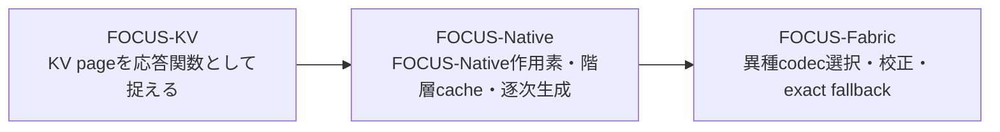
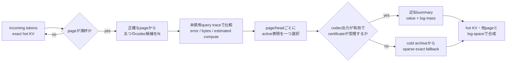
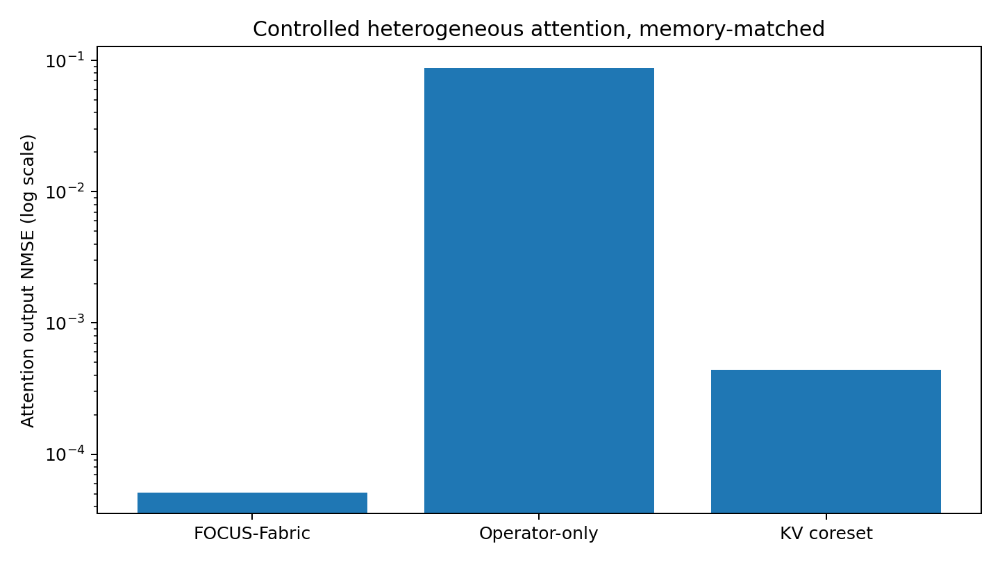

# FOCUS-Fabric 2026.07 / v0.2.1

**古いKVを「残す／捨てる」だけでなく、「将来のqueryへどう応答するか」に変換する。**

FOCUS-Fabricは、書き込みを終えたKV pageを一種類の方式で一律に圧縮しません。**FOCUS-Native由来の解析的局所attention応答作用素**（以下、**FOCUS-Native作用素**）を含む複数の表現をpage/headごとに実測比較し、選ばれた小さなactive stateでattentionへ応答します。校正済みの誤差上限が閾値を超える、またはcodec出力が無効な場合は、保存してある正確なKV原本へfallbackします。

> **Research preview — 主張の範囲**
>
> この公開版が実証するのは、controlled synthetic attention field上の数値機構と、再現・監査用の研究基盤です。自然言語能力の向上、公式LongBench/RULER/BABILongスコア、GPU高速化、物理HBM削減、million-token運用はまだ実証しておらず、主張しません。測定済みの文言は[`docs/CLAIMS_LEDGER.json`](docs/CLAIMS_LEDGER.json)に固定されています。

## 60秒で分かるFOCUS-Fabric

Transformerは過去のtokenを参照するために、**K**（何を参照するか）と**V**（何を取り出すか）をKV cacheへ残します。contextが長くなるほど、この正確なKVをactive memoryへ載せ続ける負担が増えます。

多くのKV eviction方式は、重要なtokenを選んで残します。FOCUS-Native作用素は、別の問いから始まりました。

> **固定されたKV pageを、「将来のqueryに対して、そのpageが何を、どれくらい強く返すか」という小さな応答地図へ変換できないか。**

page $B$ に対するquery $q$ の応答を、概念的に次の二つの組として扱います。

$$
q \longmapsto \bigl(F_B(q),\; \log Z_B(q)\bigr)
$$

- $F_B(q)$: そのpageが返すattention value
- $\log Z_B(q)$: 他のpageと正しい比率で混ぜるためのattention log-mass

FOCUS-Native作用素はquery空間にanchorを置き、その近くで値応答の低ランクな一階変化と、log-massの局所的な曲がりを保存します。つまり、過去のtokenを抜粋するのではなく、**過去のpageがどう答えるかを局所関数としてコンパイルする**方式です。

committed controlled experimentsでは、単一表現が全caseで最良にはなりませんでした。そこでFOCUS-Fabricは、系譜上の中核であるFOCUS-Native作用素を継承しながら、実行時には性質の異なる五つのcodecからpage/headごとに選びます。

## FOCUS-KVからFOCUS-Fabricまで

FOCUS-KV、FOCUS-Native、FOCUS-Fabricは、repository作者の[dj-thank](https://github.com/dj-thank)が継続して開発してきた同一の研究系列です。外部の別プロジェクトを取り込んだという意味ではありません。



| 世代 | 進めたこと | この公開treeで確認できるもの |
|---|---|---|
| **FOCUS-KV** | 古いKV領域を、query-conditionedな応答関数として扱う原型 | 独立した`focus_kv` packageはなく、作者提供の開発系譜として記録 |
| **FOCUS-Native** | FOCUS-Native作用素をmodel、training objective、階層cache、逐次生成へ組み込む探索 | 修復された機構を[`src/focus_native/`](src/focus_native/)に収録 |
| **FOCUS-Fabric** | 一種類の作用素へ固定せず、異種codecの選択、校正、exact fallback、evidence gateへ一般化 | 現在の監査対象実装を[`src/focus_fabric/`](src/focus_fabric/)に収録 |

この説明は作者性と技術系譜を示すもので、公開優先日や「世界初」を主張するものではありません。FOCUS-Native作用素の具体的な特徴と一次研究との境界は、[FOCUS lineage and prior-art boundary](docs/FOCUS_LINEAGE.md)にまとめています。

## 1 pageがactive memoryになるまで



### 五つの表現を、同じ契約で比較する

| Codec family | 何を小さく保存するか | 得意になり得る構造 |
|---|---|---|
| **FOCUS-Native作用素** (`OperatorCodec`) | anchorでの応答、低ランクJacobian、log-massの勾配・縮約Hessian | queryに対する応答が局所的に滑らかなpage |
| **Weighted KV coreset** | query traceに合わせた少数の代表KV | 少数の代表tokenで応答を保てるpage |
| **Gaussian/cumulant state** | key群のclusterと局所統計 | 分布的な要約が効くpage |
| **Projected moment state** | merge可能な低次元moment | 低次元の統計構造を持つpage |
| **Exact-residual hybrid** | smoothな背景近似と少数のexact KV | 大部分は滑らかだが鋭い例外を持つpage |

codec名だけで適性を決めることはしません。観測queryを**fit 40% / selection 30% / calibration 30%**へ分離し、selection split上の誤差・active bytes・推定computeで候補を比較します。選択後のcodecだけを未使用のcalibration splitで校正します。

### 近似pageを、共通のsoftmaxへ合成する

すべてのcodecは `(value output, log-mass)` を返します。互いに素なpageの結果はlog-sum-expで合成できるため、FOCUS-Native作用素、他の近似page、hot KV、fallbackしたexact pageを同じsoftmaxの下へ戻せます。**合成則は正確ですが、各codecのsummary自体は近似です。**

校正済みの誤差上限が閾値を超える、またはcodec出力が無効なpage/headは、cold archive（正確なKV原本）で評価します。また、階層mergeでは近似済みsummaryを再圧縮せず、cold archiveから親pageを再compileします。このarchiveは正確性のsource of truthであり、active-stateの圧縮率には含めません。

## 測定結果 — 数字より先に、範囲を読む

以下は、異なるattention patternを混ぜた**controlled synthetic field**をCPUで評価したcommitted artifactです。自然言語benchmarkでも、速度benchmarkでもありません。



*縦軸はlog scaleで、低いほど良い結果です。Raw data: [`results/fabric_benchmark.json`](results/fabric_benchmark.json).*

### Controlled heterogeneous attention field

| Claim | Metric | Committed result |
|---|---|---:|
| C001 | Controlled exact KV | 98,304 bytes |
| C002 | Fabric active state — exact cold archiveを除く | 8,584 bytes |
| C003 | Active-state compression — exact cold archiveを除く | **11.452x** |
| C004 | In-distribution Fabric output NMSE | **5.11794e-5** |
| C005 | Memory-matched operator output NMSE | 0.0877658 |
| C006 | Query-aware memory-matched coreset output NMSE | 0.000440168 |
| C007 | In-distribution empirical marginal coverage — target 0.95 | 0.96875 |
| C008 | Shifted empirical marginal coverage | 0.807292 |
| C009 | Shift fallback rate | 0.255208 |

このcaseでFabricは複数種類のcodecを実際に選択し、名前付きのmemory-matched operator-only / coreset-only baselineより低いin-distribution output NMSEを示しました。一方、分布shiftではcoverageがnominal targetを下回り、exact fallbackが増えています。

> **重要な範囲限定**
>
> 11.452xは**active representation**だけのcompressionです。公開referenceは別にO(N)のexact cold archiveを保持するため、総保存量が11分の1になったという結果ではありません。

### 失敗を消さず、設計へ戻した

最初のcompilerには、K-meansの一つの初期値へ依存する不安定性がありました。実装後に生成したholdout seedがその失敗を露出したため、結果を除外せず、query-aware multi-start selectionへ設計を変更しました。

修正後のretained randomized suiteは、**three seeds / 11 controlled cases**を含みます（C026–C030）。全3 runが宣言済みsafety conditionを通過し、worst run-level Fabric-to-best-single-family NMSE ratioは**0.0988026**、forced exact fallbackの最大絶対誤差は**0**、invalid codec outputは**0**でした。Raw data: [`results/randomized_holdout_suite.json`](results/randomized_holdout_suite.json)。

同時に、learned traceの一つでは**FOCUS-Native作用素**の方がFabricより低い誤差だった反例も保持しています。したがって、このreleaseは「Fabricが常に各単一方式へ勝つ」とは主張しません。その反例があるからこそ、FOCUS-Native作用素を異種codec群の有効な選択肢の一つとして残しています。

### その他の検証済みevidence

| Claims | Area | What was measured | What it does not establish |
|---|---|---|---|
| C010–C011 | Repeated compaction | Maximum relative attention error 0.0289224、invalid codec output 0 | Million-token stability |
| C012–C013 | Symbolic mechanism checkpoint | Teacher-forced argmax agreement 1.0 over 64 tokens、free-running token agreement 1.0 over 8 tokens | Natural-language ability; public weights are excluded because provenance is incomplete |
| C019–C021 | Typed semantic ledger | Protected-record retention 1.0、hash-chain verification 1.0、poison prose policy-promotion 0.0 in the committed substrate benchmark | Factual truth、cryptographic identity、general prompt-injection resistance |
| C022–C025 | GPU and official tasks | GPU status is `not_executed`; LongBench、RULER、BABILong fields are `null` | GPU speedup or official long-context quality |

数値とartifact digestを結ぶ公開可能な文言は[`docs/CLAIMS_LEDGER.json`](docs/CLAIMS_LEDGER.json)、意味と非主張は[`docs/CLAIMS.md`](docs/CLAIMS.md)にあります。

## 5分で動かす

必要環境はGitとPython 3.10以上です。最小例はCPUだけで実行できます。

### Windows PowerShell

```powershell
git clone https://github.com/dj-thank/FOCUS-Fabric.git
Set-Location FOCUS-Fabric
py -m venv .venv
.\.venv\Scripts\python.exe -m pip install -e ".[dev]"
.\.venv\Scripts\python.exe examples\minimal_fabric.py
```

### Linux / macOS

```bash
git clone https://github.com/dj-thank/FOCUS-Fabric.git
cd FOCUS-Fabric
python3 -m venv .venv
source .venv/bin/activate
python -m pip install -e '.[dev]'
python examples/minimal_fabric.py
```

この例は64 tokenをstreamし、最後のattention output shapeと次のreportを表示します。

| Output field | 読み方 |
|---|---|
| `tokens` | layerへ追加したtoken数 |
| `page_levels` | binary-counter型のactive page階層 |
| `active_compression` | compiled active stateに対するexact active KVのbyte比（exact / active）。cold archiveは除く |
| `fallback_rate` | page/headの評価判断のうち、exact KVへ戻った割合 |

中心となるAPIは、tokenごとにquery/key/valueを追加しながらattention outputを得る形です。

```python
layer = MemoryFabricLayer.create(config)

for query, key, value in token_stream:
    output = layer.append_and_attend(query, key, value)

report = layer.report()
```

importと完全な設定を含む例は[`examples/minimal_fabric.py`](examples/minimal_fabric.py)、typed agent memoryの例は[`examples/typed_agent_memory.py`](examples/typed_agent_memory.py)を参照してください。

## このrepositoryに含まれる範囲

| 層 | 役割 | 位置づけ |
|---|---|---|
| Numerical memory core | Heterogeneous codec、compiler、hierarchy、certificate、fallback | FOCUS-Fabricの中心 |
| Optional integrity layer | Typed semantic ledger、extractive capsule、verified greedy decode | agentや生成経路向けの追加機構 |
| Research harness | Randomized holdout、claim ledger、drift gate、Codex worktree orchestration | 実験と公開主張を監査する基盤 |

三層は同じrepositoryで検証できますが、すべてを一つのproduction runtimeとして完成させたという意味ではありません。

## 検証gateとevidenceを再現する

通常の検証gateは、Linux/macOSでは次の一行です。

```bash
make gate
```

Windowsではeditable install後に同じ四工程を個別実行します。

```powershell
$env:PYTHONPATH = "src"
.\.venv\Scripts\python.exe -m compileall -q src scripts tests
.\.venv\Scripts\python.exe -m pytest -q
.\.venv\Scripts\python.exe scripts\autonomy\validate_claims.py
.\.venv\Scripts\python.exe scripts\autonomy\detect_drift.py
```

公開用のwheelとsdistは、通常のtestとは別にarchive内部まで検査します。

```bash
make package-check
```

このgateはcleanなGit `HEAD`だけを隔離した作業領域へexportして再buildし、path traversal、artifact symlink、archive内link、version不一致、package本体の欠落に加え、公開対象外の`.safetensors` / `.pt` / `.pth` / `.ckpt` / `.bin` / `.onnx`が一つでも入れば失敗します。wheelはsource tree外の一時targetへinstallしてimportし、source ZIPも同じsuffix policyで生成後に再検査します。`0.2.0`の公開前sdist候補は、この検査を遡って適用した結果checkpoint weight混入が判明したため、公開せず`0.2.1`へ置き換えています。

Linux/macOSでは、次のtargetがcommitted evidence artifactを再生成します。

```bash
make benchmark
make agent-memory
make holdout
make gpu-benchmark
make autonomy-dry-run
```

これらは`results/`のtracked artifactを上書きします。環境情報や浮動小数点差も記録されるため、clean branchで実行し、`git diff`を確認してください。Windowsでの個別commandと評価条件は[Evaluation contract](docs/EVALUATION.md)にあります。

認証済みの現行Codex CLIを使い、H001をisolated worktreeで実行する場合:

```powershell
.\scripts\autonomy\run_cycle.cmd --mode preflight --hypothesis H001-forward-influence-routing
.\scripts\autonomy\run_cycle.cmd --mode execute --hypothesis H001-forward-influence-routing
```

既定のexecuteはcandidateをcommitもmergeもしません。inner Codexの既定Pythonをproject venvに、`PYTHONPATH`をcandidate側`src`に固定し、偶発的なglobal Python fallbackやroot実装の誤importをpreflightで防ぎます。H001のcheckpoint評価には、公開対象外のweightを[`checkpoints/README.md`](checkpoints/README.md)記載のpathへ置いたauthorized local copyが必要です。preflightはSHA-256を照合し、weightをworktreeへcopyしません。明示的な別Python起動は技術的に不可能なのではなく規約違反です。automatic promotionは`--auto-promote`を明示した場合だけ有効になり、それでもtests、claim integrity、post-hoc randomized holdout、exactness constraints、H001のprimary-metric contractをすべて通る必要があります。詳しい安全境界は[Codex autonomous operation](docs/CODEX_AUTONOMY.md)を参照してください。

> **自律パイプラインの実運転状態（2026-07-17）**
>
> Windows上のH001 live cycleは、6役の`gpt-5.6-luna` specialist、candidate/trusted tests、claims、drift、randomized holdoutまで完走しました。version-1 holdout契約では固定benchmarkの改善によりcandidateを`accepted`と判定しましたが、独立reviewで4件のpaired holdoutへの差が最大でも約1.73e-9、測定可能な変化が0件だったと判明しました。candidateはcommit・merge・pushしていません。現在の契約はcase単位のpaired non-regressionとminimum effectを事前登録し、同じcandidateを`insensitive`として拒否します。これは研究ループが「動いた」ことと、生成コードが「採用に値する」ことを分けるためのfail-closed更新です。

## 現在の限界

- Exact cold archiveはsource of truthとして残るため、total retained storageはO(N)です。
- Python CPU referenceはvectorized exact attentionより遅く、速度実装ではありません。
- Triton codeとABIはありますが、このrelease environmentではCUDA/GPU benchmarkを実行していません。
- LongBench、RULER、BABILong、LifeBench、modern production LLM、million-token runは未実施です。
- Split-conformal certificateは交換可能性の仮定に依存し、distribution shift下の普遍保証ではありません。
- Hash chainは改変検知用です。外部の真実性、認証、trusted timestampを保証しません。
- FOCUS-Native lossは新規training run向けに実装されていますが、archived checkpointが現在のfull objectiveで学習済みだとは主張しません。
- Autonomous research harnessはcandidate Pythonをhost上で検証するため、敵対的・第三者由来のhypothesisには別VM/containerが必要です。

詳細は[Weakness audit](docs/WEAKNESS_AUDIT.md)と[Limitations](docs/LIMITATIONS.md)を参照してください。

## Documentation map

- [FOCUS lineage and prior-art boundary](docs/FOCUS_LINEAGE.md) — FOCUS-KV／FOCUS-NativeからFabricまでの作者系譜と、既存研究との重なり・境界。
- [Architecture](docs/ARCHITECTURE.md) — 数学的contract、codec、hierarchy、fallback。
- [Paper draft](docs/PAPER_DRAFT.md) — publication-style method and evidence draft。
- [Research synthesis, July 2026](docs/RESEARCH_SYNTHESIS_2026-07.md) — 一次文献と設計判断。
- [Evaluation contract](docs/EVALUATION.md) — split、metric、baseline、再現条件。
- [Claims and non-claims](docs/CLAIMS.md) — 公開可能な主張と範囲外。
- [Model card](docs/MODEL_CARD.md) — archived FOCUS-Native mechanismの位置づけ。
- [Codex autonomous operation](docs/CODEX_AUTONOMY.md) — isolated experiment workflow。
- [Reproducibility](docs/REPRODUCIBILITY.md) — environment、artifact、checkpoint handling。
- [Publication status](docs/PUBLICATION_STATUS.md) — 現在のrelease status。

## Creator, citation, and license

The FOCUS research line and FOCUS-Fabric were created by **[dj-thank](https://github.com/dj-thank)**. Additional release work is credited to the FOCUS-Fabric research release contributors.

引用情報は[`CITATION.cff`](CITATION.cff)にあります。コードとdocumentationはApache-2.0です。historical checkpointのweight binariesは、元のtraining dataとredistribution provenanceが不完全なため公開repositoryから除外しています。詳細は[`checkpoints/README.md`](checkpoints/README.md)を参照してください。
