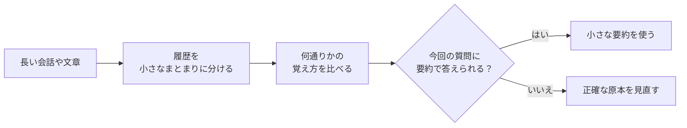
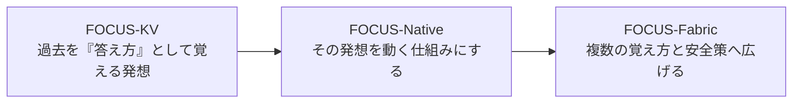

# FOCUS-Fabric 2026.07 / v0.2.1

> **公開版:** [`v0.2.1 — Unsigned Research Preview`](https://github.com/dj-thank/FOCUS-Fabric/releases/tag/v0.2.1)
> 固定ソース: [`069351b`](https://github.com/dj-thank/FOCUS-Fabric/commit/069351b0a586487961f3d7c54fb3c94bb70c32cc) / 完全なハッシュ一覧はRelease添付の`ARTIFACT_SHA256SUMS`を参照してください。

## AIの「長い記憶」を、もっと扱いやすくする研究

長い会話や文章を扱うAIは、前に出てきた内容を参照しながら次の答えを作ります。ところが、会話が長くなるほど、参照のために持ち続けるデータも増えていきます。

たとえるなら、何冊もの本を調べるために、すべてのページを机の上へ広げ続けるようなものです。正確ではありますが、机はすぐにいっぱいになります。

**FOCUS-Fabricは、本を捨てるのではなく、まず使いやすい「案内カード」を作る研究です。**

- 履歴を小さなまとまりに分ける
- まとまりごとに、何通りかの覚え方を試す
- 実際のデータで、いちばん合う覚え方を選ぶ
- 案内カードだけでは危ないときは、正確な原本を見直す

つまり、普段使う机の上は小さく保ちながら、必要なときには本棚の原本へ戻れるようにします。ここでいう原本は元の文章そのものではなく、AIのattention（過去の情報へ重みを付けて参照する計算）に使う正確な中間データです。



## これは何で、何ではないのか

FOCUS-Fabricは、AIモデルそのものではありません。AIが過去を参照するときに使う**記憶部分の扱い方**を調べる、Python製の研究基盤です。

現在の公開版で確認できるのは、人工的に設計したattentionのテスト上で、複数の要約方法を選び、安全に原本へ戻る仕組みが動くことです。

一方、次のことはまだ実証していません。

- ChatGPTのようなAIの回答が賢くなること
- 実際の長文読解ベンチマークで高得点を取ること
- GPUで高速に動くことや、物理メモリ全体が大幅に減ること
- 100万token（文章を分けた小さな単位）級の長時間運用に耐えること
- どんな状況でも、単一の方法より必ず優れること

このため、公開版は**製品版ではなく、署名なしの研究プレビュー**として提供しています。

## 5分で試す

必要なのはGitとPython 3.10以上です。サンプルはCPUだけで動かせます。

### Windows PowerShell

```powershell
git clone https://github.com/dj-thank/FOCUS-Fabric.git
Set-Location FOCUS-Fabric
py -m venv .venv
.\.venv\Scripts\python.exe -m pip install -e ".[dev]"
.\.venv\Scripts\python.exe examples\minimal_fabric.py
```

### Linux / macOS

```bash
git clone https://github.com/dj-thank/FOCUS-Fabric.git
cd FOCUS-Fabric
python3 -m venv .venv
source .venv/bin/activate
python -m pip install -e '.[dev]'
python examples/minimal_fabric.py
```

サンプルを実行すると、64個の小さな入力を順番に追加し、次のような情報を表示します。

- いくつの入力を記憶へ追加したか
- 実行中の小さな要約が、元データに比べてどのくらいの大きさか
- 要約を信用せず、正確な原本へ戻った割合

これは大規模言語モデルのデモではなく、記憶の仕組みだけを確かめる最小例です。

## 研究で分かったこと

以下は、性質の違う注意パターンを混ぜた**人工的なCPUテスト**の結果です。自然言語の能力や実運用速度を測った結果ではありません。


このテストから、少なくとも次のことが分かりました。

| 確認できたこと | 一般的な読み方 |
|---|---|
| 制御実験で使った、圧縮前の正確なKV全体98,304 bytesに対し、選ばれた要約は8,584 bytes | **実行中に使う要約部分**は約11.45分の1（11.452倍の圧縮率）になった |
| 似た条件では、目標0.95に対して0.96875のカバー率 | カバー率は「誤差判定が想定どおり収まった問い合わせの割合」。想定した条件では、おおむね目標どおり働いた |
| 条件を変えるとカバー率は0.807292へ低下し、0.255208の割合で原本へ戻った | 苦手な状況では精度が落ち、安全のため約4回に1回は原本を使った |
| ある学習済みデータでは、FOCUS-Nativeの方法がFabricより良かった | Fabricがいつでも最良だとは言えない |

### 数字を読むときの大切な注意

**11.452倍という値は、机の上で使う要約部分だけの比較です。**

現在の公開実装は、間違いが疑われるときに戻れるよう、正確な原本を別に保存します。そのため、保存量全体が11.452分の1になったという意味ではありません。原本を残すコストは、現在の大きな制約の一つです。

また、開発中に見つかった失敗や不利な結果も削除していません。条件が変わると安全判定が弱くなることや、単独の方法が勝つ例を残し、それを次の設計変更へ使っています。

正確な測定値、比較対象、実験条件は[Claims and non-claims](docs/CLAIMS.md)と[`docs/CLAIMS_LEDGER.json`](docs/CLAIMS_LEDGER.json)で確認できます。元データは[`results/fabric_benchmark.json`](results/fabric_benchmark.json)と[`results/randomized_holdout_suite.json`](results/randomized_holdout_suite.json)です。

## FOCUS-KV、FOCUS-Native、FOCUS-Fabricの関係

この三つは、外部の別プロジェクトを組み合わせたものではありません。すべて[dj-thank](https://github.com/dj-thank)が継続して開発してきた、同じ研究の流れです。



- **FOCUS-KV** — 過去の情報を、単に残すか捨てるかではなく、「次の質問へどう答えるか」という形で覚える原型
- **FOCUS-Native** — その発想を、実際に計算できる記憶の仕組みへした段階
- **FOCUS-Fabric** — 一つの覚え方へ固定せず、複数の方法を比べ、危ないときは原本へ戻れるようにした現在の研究基盤

この説明は作者と技術の系譜を示すもので、「世界初」や公開優先日を主張するものではありません。詳しくは[FOCUS lineage and prior-art boundary](docs/FOCUS_LINEAGE.md)を参照してください。

<details>
<summary><strong>もう少し技術的に知りたい方へ</strong></summary>

### 用語を日常語に置き換えると

| 技術用語 | このREADMEでの意味 |
|---|---|
| KV cache | AIが過去の入力を参照するために保持する中間データ |
| page | 履歴を区切った一つのまとまり |
| query | いま行おうとしている問い合わせ |
| codec | pageを小さく覚えるための要約方式 |
| active state | 実行中に机の上へ置く小さな要約 |
| exact cold archive | 必要なときに見直す正確な原本 |
| fallback | 要約を使わず、正確な原本へ戻ること |

技術文書では、中心となる仕組みを**FOCUS-Native由来の解析的局所attention応答作用素**（**FOCUS-Native作用素**）と呼びます。過去のtokenを抜き出して残すのではなく、固定された履歴のまとまりを「次の問い合わせへ何を、どのくらい強く返すか」という小さな応答地図に変換します。

FOCUS-Fabricは、この方式を含む五種類の要約候補をpageとattentionの計算単位ごとに比較します。候補を作るデータ、選ぶデータ、誤差を確認するデータを分け、選ばれた方式だけを最後の未使用データで調整します。要約の出力が無効な場合や、その未使用データから決めた誤差上限を超えた場合は、正確な原本へ戻ります。

各方式の数式、選択規則、合成方法は[Architecture](docs/ARCHITECTURE.md)と[Evaluation contract](docs/EVALUATION.md)にあります。

</details>

<details>
<summary><strong>開発者向け: 最小APIと検証コマンド</strong></summary>

中心APIは、入力ごとにquery/key/valueを追加しながらattentionの出力を得る形です。

```python
layer = MemoryFabricLayer.create(config)

for query, key, value in token_stream:
    output = layer.append_and_attend(query, key, value)

report = layer.report()
```

完全なimportと設定は[`examples/minimal_fabric.py`](examples/minimal_fabric.py)、agent memoryの例は[`examples/typed_agent_memory.py`](examples/typed_agent_memory.py)にあります。

Linux / macOSの通常検証:

```bash
make gate
make package-check
```

Windows PowerShellの同等検証:

```powershell
$env:PYTHONPATH = "src"
.\.venv\Scripts\python.exe -m compileall -q src scripts tests
.\.venv\Scripts\python.exe -m pytest -q
.\.venv\Scripts\python.exe scripts\autonomy\validate_claims.py
.\.venv\Scripts\python.exe scripts\autonomy\detect_drift.py
.\.venv\Scripts\python.exe scripts\release\build_distributions.py --output-dir dist --replace
```

公開用ビルダーはcleanなGit commitだけを隔離して使い、危険なarchive path、link、version不一致、package欠落、公開対象外のmodel weightがあれば失敗します。Codexを使う自律研究ループの安全境界は[Codex autonomous operation](docs/CODEX_AUTONOMY.md)に分離しています。

</details>

## 現在の主な限界

- 正確な原本を残すため、保存量全体は履歴とともに増えます。
- 現在のPython CPU実装は、速度を競う完成品ではありません。
- GPUでの正しさ、速度、物理メモリ帯域はまだ測定していません。
- LongBench、RULER、BABILong、LifeBenchなどの公式評価はまだ実行していません。
- 条件が変わると誤差判定の信頼性が下がり、原本へ戻る回数が増えます。
- 「正確な原本へ戻れる」のは、その原本を別に保持し、利用できる場合だけです。要約だけから元の情報を完全に復元する仕組みではありません。
- この研究だけで、データのプライバシー、機密性、アクセス権限の安全性が保証されるわけではありません。
- 公開しているテスト結果だけで、自然言語能力や一般的な安全性は証明できません。
- 自律研究ループが動くことと、その生成コードを採用・公開して安全であることは別です。現在の仕組みは、効果を測れない候補を拒否しますが、自律公開の安全性までは証明しません。

詳しくは[Weakness audit](docs/WEAKNESS_AUDIT.md)と[Limitations](docs/LIMITATIONS.md)を参照してください。

## もっと詳しく読む

### まず読む文書

- [FOCUS lineage and prior-art boundary](docs/FOCUS_LINEAGE.md) — 三世代の研究の流れと、関連研究との境界
- [Claims and non-claims](docs/CLAIMS.md) — 何を確認でき、何をまだ主張できないか
- [Evaluation contract](docs/EVALUATION.md) — 数字をどの条件で測ったか
- [Limitations](docs/LIMITATIONS.md) — 現在の制約

### 実装・再現・監査

- [Architecture](docs/ARCHITECTURE.md) — 数学的な契約、要約方式、階層、原本への復帰
- [Paper draft](docs/PAPER_DRAFT.md) — 論文形式の手法と結果
- [Research synthesis, July 2026](docs/RESEARCH_SYNTHESIS_2026-07.md) — 一次文献と設計判断
- [Model card](docs/MODEL_CARD.md) — FOCUS-Native機構の位置づけ
- [Codex autonomous operation](docs/CODEX_AUTONOMY.md) — 隔離した自律実験の流れ
- [Reproducibility](docs/REPRODUCIBILITY.md) — 環境、成果物、checkpointの扱い
- [Publication status](docs/PUBLICATION_STATUS.md) — 現在の公開状態

## 作者、引用、ライセンス

FOCUS-KV、FOCUS-Native、FOCUS-Fabricは**[dj-thank](https://github.com/dj-thank)**が作成しました。リリース整備への追加貢献は、FOCUS-Fabric research release contributorsに帰属します。

引用情報は[`CITATION.cff`](CITATION.cff)にあります。コードと文書はApache-2.0です。由来と再配布条件を十分に確認できないhistorical checkpointのweight binariesは、公開リポジトリとReleaseから除外しています。詳しくは[`checkpoints/README.md`](checkpoints/README.md)を参照してください。
