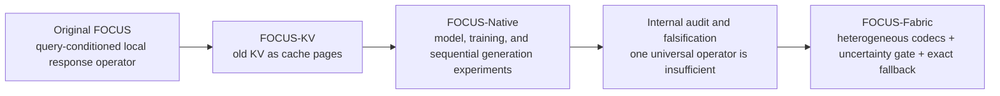
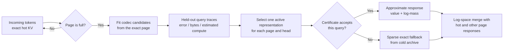

# FOCUS-Fabric 2026.07

**Different parts of a Transformer's past need different kinds of memory.**

FOCUS-Fabricは、Transformerの古いKVを一律に圧縮するのではなく、page/headごとに複数の記憶表現を比較し、不確実なときは保存してあるexact K/Vへ戻る研究プロトタイプです。

> **Research preview**
>
> この公開版が示すのは、controlled attention field上の数値機構、構造的なagent-memory保護、検証可能な生成経路、および再現用研究基盤です。既存の大規模一般LLMを上回る自然言語能力、公式LongBench/RULER/BABILongスコア、GPU高速化、物理HBM削減、million-token運用はまだ実証しておらず、主張しません。

## 60秒で分かるFOCUS-Fabric

Transformerは過去のtokenを参照するために、**K**（検索用の索引）と**V**（取り出す内容）をKV cacheへ残します。文脈が長くなるほど、その原本をすべてactiveな状態で持つ負担も大きくなります。

最初のFOCUSは、古いKVを単に間引く代わりに、**「その過去の領域が、将来のqueryへどう応答するか」**を小さな局所作用素として表現できないか、という発想から始まりました。しかし内部監査と反証実験から、一種類の作用素ですべてのlayer、head、pageをうまく表せるわけではないことも分かりました。

そこでFOCUS-Fabricは、初期FOCUSの作用素を捨てず、複数の専門表現の一つとして統合しました。各候補をheld-out query trace上の誤差・active bytes・推定computeで比較し、近似が危険ならexact archiveへ戻ります。

## 同じ作者が進めてきたFOCUSの系譜

FOCUSは、このrepositoryの作者である[dj-thank](https://github.com/dj-thank)が進めてきた独自の研究系列です。FOCUS-KVとFOCUS-Nativeは外部プロジェクトではなく、FOCUS-Fabricへ至る同一作者の初期世代です。

> この文書の**旧FOCUS**は「以前のFOCUS」を意味し、同一作者の初期方式を指します。別製品名や、第三者の方式ではありません。



- **Original FOCUS** — query-space上のanchor付近で、attention outputとsoftmaxのlog-massを低ランク局所近似する発想。
- **FOCUS-KV** — その発想を、古いKV領域を扱うcache pageとして整理した初期段階の名称。この公開treeに独立した`focus_kv` packageはありません。
- **FOCUS-Native** — model、training objective、階層cache、逐次生成へ組み込む道を探った初期実装。修復された機構は`src/focus_native/`に残っています。
- **FOCUS-Fabric** — 初期作用素を五つのcodec familyの一候補として残し、page/headごとの測定結果から表現を選び、certificateとexact fallbackを加えた現在の公開形。

この系譜と既存研究との境界は、[FOCUS research lineage and prior-art boundary](docs/FOCUS_LINEAGE.md)にまとめています。個々の構成要素すべてが新しい、あるいは世界初であるとは主張しません。公開版の中心は、作者自身の初期仮説を反証可能な形で検証し、その有効な核をheterogeneousでreversibleなmemory fabricへ発展させた点にあります。

## 図書館として考える

FOCUS-Fabricは、単一の「圧縮アルゴリズム」というより、研究用の**記憶制御面**として考えると分かりやすくなります。

| FOCUS-Fabric | 図書館での役割 |
|---|---|
| Exact hot KV | いま机の上で開いている原本 |
| Compiled active page | 普段の検索に使う索引カードや整理ノート |
| Codec portfolio | 索引、代表例、統計表、低次元メモ、原文付きメモの使い分け |
| Exact cold archive | 索引だけでは危険なときに戻れる書庫の原本 |
| Uncertainty gate | 索引で答えてよいか、原本を確認すべきか判断する司書 |
| Typed semantic ledger | 方針・制約・未解決の約束を普通の要約から守る監査台帳 |
| Verified greedy decode | 下書きをexact oracleでtokenごとに確認する検査係 |

ここでいうcompiled pageは、文章の要約ではありません。**将来のattention queryへ数値的に応答し、回答値とその棚の重み（log-mass）を返せる表現**です。また、codecの選択は人名・数式などを理解するsemantic分類器ではなく、page/headごとのquery traceで測った近似誤差、bytes、computeに基づきます。

## 実際の処理



選択対象は次の五系統です。

1. **Local response operator** — 初期FOCUSの中心だった、anchor周辺の低ランクTaylor近似。
2. **Weighted KV coreset** — query traceに合わせて少数の代表KVを選ぶ表現。
3. **Gaussian/cumulant state** — key群の局所分布を統計量で表す表現。
4. **Projected moment state** — merge可能な低次元moment表現。
5. **Exact-residual hybrid** — smoothな近似に、重要な少数KVをexact residualとして残す表現。

近似page同士は、attention outputだけでなくlog-normalizerも返すため、hot KVや他のpageとlog-spaceで合成できます。階層merge時には近似状態をさらに圧縮せず、exact archiveをsource of truthとして再compileします。

## Repositoryに含まれる三つの層

| 層 | 役割 | 位置づけ |
|---|---|---|
| Numerical memory core | Heterogeneous codec、compiler、hierarchy、certificate、fallback | FOCUS-Fabricの中心 |
| Optional integrity layer | Typed semantic ledger、extractive capsule、verified greedy decode | agentや生成経路向けの追加機構 |
| Research harness | Randomized holdout、claim ledger、drift gate、Codex worktree orchestration | 実験と公開主張を監査する基盤 |

この三層は同じrepositoryで検証できますが、すべてを一つのproduction runtimeとして完成させたという意味ではありません。

## 5分Quickstart

必要環境はGitとPython 3.10以上です。

### Windows PowerShell

```powershell
git clone https://github.com/dj-thank/FOCUS-Fabric.git
Set-Location FOCUS-Fabric
py -m venv .venv
.\.venv\Scripts\python.exe -m pip install -e ".[dev]"
.\.venv\Scripts\python.exe examples\minimal_fabric.py
```

### Linux / macOS

```bash
git clone https://github.com/dj-thank/FOCUS-Fabric.git
cd FOCUS-Fabric
python3 -m venv .venv
source .venv/bin/activate
python -m pip install -e '.[dev]'
python examples/minimal_fabric.py
make gate
```

`examples/minimal_fabric.py`は64 tokenをstreamし、最後のattention output shapeと、token数、page階層、active compression、fallback rateを表示します。最小APIは次の形です。

```python
layer = MemoryFabricLayer.create(config)

for query, key, value in token_stream:
    output = layer.append_and_attend(query, key, value)

print(layer.report())
```

完全な設定を含む実行例は[`examples/minimal_fabric.py`](examples/minimal_fabric.py)、typed agent memoryの例は[`examples/typed_agent_memory.py`](examples/typed_agent_memory.py)を参照してください。

Windowsで`make gate`と同じ検証を行う場合は、editable install後に次を実行します。

```powershell
$env:PYTHONPATH = "src"
.\.venv\Scripts\python.exe -m compileall -q src scripts tests
.\.venv\Scripts\python.exe -m pytest -q
.\.venv\Scripts\python.exe scripts\autonomy\validate_claims.py
.\.venv\Scripts\python.exe scripts\autonomy\detect_drift.py
```

## 測定結果


*Committed CPU artifactのcontrolled synthetic attention field。縦軸はlog scaleで、低いほど良い結果です。これは自然言語benchmarkでも、速度benchmarkでもありません。Raw data: [`results/fabric_benchmark.json`](results/fabric_benchmark.json).*

### Controlled heterogeneous attention

| Claim-ledger metric | Committed result |
|---|---:|
| Controlled exact KV bytes | 98,304 |
| Controlled active Fabric bytes | 8,584 |
| Controlled active compression | **11.452x** |
| In-distribution Fabric output NMSE | **5.11794e-5** |
| Memory-matched operator output NMSE | 0.0877658 |
| Query-aware memory-matched coreset output NMSE | 0.000440168 |
| In-distribution empirical conformal coverage | 0.96875 |
| Shifted empirical coverage | 0.807292 |
| Shift fallback rate | 0.255208 |

このcommitted caseでは、異なるattention patternを混ぜたcontrolled fieldに対し、Fabricは複数種類の表現を実際に選択しました。単一のoperator-onlyまたはcoreset-only比較より低いin-distribution output NMSEを示し、分布shiftではcoverageがnominal targetを下回ってexact fallbackが増えました。

> **重要な範囲限定**
>
> 11.452xは**active representation**だけのcompressionです。公開referenceは別にO(N)のexact cold archiveを保持するため、総保存量が11分の1になったという結果ではありません。

### 失敗を消さず、設計へ戻した

最初のcompilerには、K-meansの一つの初期値へ依存する不安定性がありました。実装後に生成したholdout seedがその失敗を露出したため、結果を除外せず、query-aware multi-start selectionへ設計を変更しました。

修正後のretained randomized suiteは、**three seeds / 11 controlled cases**を含みます。全3 runが宣言済みsafety conditionを通過し、worst run-level Fabric-to-best-single-family NMSE ratioは**0.0988026**、forced exact fallbackの最大絶対誤差は**0**、invalid codec outputは**0**でした。Raw data: [`results/randomized_holdout_suite.json`](results/randomized_holdout_suite.json)。

同時に、learned traceの一つでは初期FOCUS作用素の方がFabricより低い誤差だった反例も保持しています。したがって、このreleaseは「Fabricが常に各単一方式へ勝つ」とは主張しません。むしろ、その反例があるからこそ旧作用素を専門家の一つとして残します。

### そのほかのaccepted evidence

| Area | What was measured | What it does not establish |
|---|---|---|
| Repeated compaction | Maximum relative attention error 0.0289224、invalid codec output 0 | Million-token stability |
| Symbolic mechanism checkpoint | Teacher-forced argmax agreement 1.0 over 64 tokens、free-running token agreement 1.0 over 8 tokens | Natural-language ability; public weights are excluded because provenance is incomplete |
| Typed semantic ledger | Protected-record retention 1.0、hash-chain verification 1.0、poison prose policy-promotion 0.0 in the committed substrate benchmark | Factual truth、cryptographic identity、general prompt-injection resistance |
| GPU and official tasks | GPU status is `not_executed`; LongBench、RULER、BABILong fields are `null` | GPU speedup or official long-context quality |

数値とartifact digestを結ぶ公開可能な文言は[`docs/CLAIMS_LEDGER.json`](docs/CLAIMS_LEDGER.json)、意味と非主張は[`docs/CLAIMS.md`](docs/CLAIMS.md)にあります。

## Evidenceを再生成する

Linux/macOSでは、次のtargetがcommitted evidence artifactを再生成します。

```bash
make benchmark
make agent-memory
make holdout
make gpu-benchmark
make autonomy-dry-run
```

これらは`results/`のtracked artifactを上書きします。環境情報や浮動小数点差も記録されるため、clean branchで実行し、`git diff`を確認してください。Windowsでの個別commandと評価条件は[Evaluation contract](docs/EVALUATION.md)にあります。

認証済みの現行Codex CLIを使って一つのhypothesisをisolated worktreeで実行する場合:

```bash
python scripts/autonomy/run_codex_loop.py --mode execute --max-hypotheses 1
```

committed artifactはdry-runまでです。automatic promotionは`--auto-promote`を明示した場合だけ有効になり、それでもtests、claim integrity、post-hoc randomized holdout、exactness constraints、public-evidence improvementを通る必要があります。

## 現在の限界

- Exact cold archiveはsource of truthとして残るため、total retained storageはO(N)です。
- Python CPU referenceはvectorized exact attentionより遅く、速度実装ではありません。
- Triton codeとABIはありますが、このrelease environmentではCUDA/GPU benchmarkを実行していません。
- LongBench、RULER、BABILong、LifeBench、modern production LLM、million-token runは未実施です。
- Split-conformal certificateは交換可能性の仮定に依存し、distribution shift下の普遍保証ではありません。
- Hash chainは改変検知用です。外部の真実性、認証、trusted timestampを保証しません。
- FOCUS-native lossは新規training run向けに実装されていますが、archived checkpointが現在のfull objectiveで学習済みだとは主張しません。
- Autonomous research harnessのexecute-mode改善artifactはまだ公開されていません。

詳細は[Weakness audit](docs/WEAKNESS_AUDIT.md)と[Limitations](docs/LIMITATIONS.md)を参照してください。

## Documentation map

- [FOCUS lineage and prior-art boundary](docs/FOCUS_LINEAGE.md) — 初期FOCUSからFabricまでの作者系譜と、既存研究との重なり・境界。
- [Architecture](docs/ARCHITECTURE.md) — 数学的contract、codec、hierarchy、fallback。
- [Paper draft](docs/PAPER_DRAFT.md) — publication-style method and evidence draft。
- [Research synthesis, July 2026](docs/RESEARCH_SYNTHESIS_2026-07.md) — 一次文献と設計判断。
- [Evaluation contract](docs/EVALUATION.md) — split、metric、baseline、再現条件。
- [Claims and non-claims](docs/CLAIMS.md) — 公開可能な主張と範囲外。
- [Model card](docs/MODEL_CARD.md) — archived FOCUS-Native mechanismの位置づけ。
- [Codex autonomous operation](docs/CODEX_AUTONOMY.md) — isolated experiment workflow。
- [Reproducibility](docs/REPRODUCIBILITY.md) — environment、artifact、checkpoint handling。
- [Publication status](docs/PUBLICATION_STATUS.md) — 現在のrelease status。

## Creator, citation, and license

The FOCUS research line and FOCUS-Fabric were created by **[dj-thank](https://github.com/dj-thank)**. Additional release work is credited to the FOCUS-Fabric research release contributors.

引用情報は[`CITATION.cff`](CITATION.cff)にあります。コードとdocumentationはApache-2.0です。historical checkpointのweight binariesは、元のtraining dataとredistribution provenanceが不完全なため公開repositoryから除外しています。詳細は[`checkpoints/README.md`](checkpoints/README.md)を参照してください。
