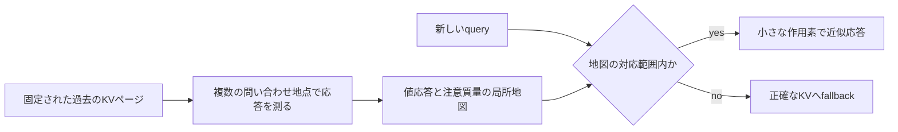
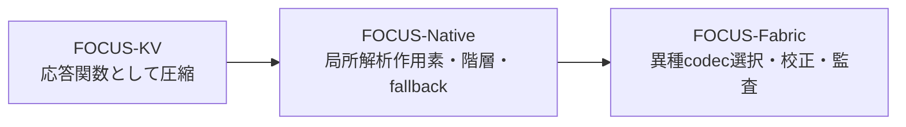

# 旧FOCUSからFOCUS-Fabricへ

> **文書の目的**  
> この文書は、作者が開発してきた **FOCUS-KV → FOCUS-Native → FOCUS-Fabric** の系譜を、人間に分かりやすい言葉で説明し、関連研究に対して何を新規性候補として主張できるかを切り分けるためのものです。性能値の正式な根拠は [`CLAIMS_LEDGER.json`](CLAIMS_LEDGER.json) と [`CLAIMS.md`](CLAIMS.md) です。

## まず30秒で分かる説明

長い会話や文書を扱うLLMは、過去の各トークンについて Key と Value（KV）を保持します。通常のKV圧縮は、その中から「重要そうなトークンを残す」、または「複数トークンを代表値にまとめる」という発想を取ります。

旧FOCUSの中心的な発想は少し違います。

**過去のページそのものを保存する代わりに、そのページが将来の問い合わせにどう答えるかを、小さな局所関数として保存する。**

たとえるなら、教科書から数ページを切り抜いて残すのではなく、「この話題を質問されたら、このページはどんな答えを、どれくらい強く返すか」という応答地図を作る方式です。地図が信頼できる範囲を外れた問い合わせには、原文に相当する正確なKVを参照します。

FOCUS-Fabricは、この旧FOCUS作用素を捨てたものではありません。作用素を一つの中核的な表現方式として継承しながら、ページとattention headごとに複数の表現方式を比較し、独立データで選択・校正し、危険な問い合わせを正確なKVへ戻す仕組みへ一般化したものです。

## 作者による開発系譜

この系譜は、作者提供の開発履歴と、現在のリポジトリに残る実装・変更履歴を突き合わせて整理しています。**作者による継承関係の説明**と、**第三者に対する世界初・公開優先日の証明**は別の主張です。後者には、日時を第三者検証できるアーカイブや公開記録が追加で必要です。

| 世代 | 中心となる問い | 得られた仕組み | 現在確認できる位置づけ |
|---|---|---|---|
| **FOCUS-KV** | KVを単に間引くのではなく、「問い合わせに対する応答関数」として圧縮できないか | query-conditionedな応答を保存するという原型 | 作者提供の初期開発履歴。現在の公開リポジトリだけでは、当時の全実験や公開優先日は再構成できない |
| **FOCUS-Native** | 応答関数を、微分可能で階層化可能な作用素として実装できないか | query anchor、低ランクJacobian、log attention massの勾配・縮約Hessian、階層ページ、対応範囲外のexact fallback | [`src/focus_native/model.py`](../src/focus_native/model.py) と [`src/focus_native/cache.py`](../src/focus_native/cache.py) に機構が残る |
| **FOCUS-Fabric** | データの性質が場所やheadごとに異なるとき、一種類の圧縮器へ固定せず安全に選べるか | 旧FOCUS作用素を含むcodec群、page/head単位の選択、fit/select/calibrate分離、校正付きfallback、exact archiveからの再コンパイル、機械検証可能なclaims ledger | 現在の監査対象実装。設計は [`ARCHITECTURE.md`](ARCHITECTURE.md)、限界は [`WEAKNESS_AUDIT.md`](WEAKNESS_AUDIT.md) に記録 |

この関係は、次のように要約できます。

## 旧FOCUS作用素は何を保存するのか

あるKVページ \(B\) に含まれる key を \(k_i\)、value を \(v_i\)、新しいqueryを \(q\) とします。そのページ単独のattention応答は、概念的には次の二つに分けられます。

\[
Z_B(q)=\sum_{i\in B}\exp(q^\top k_i/\sqrt d),
\qquad
s_B(q)=\log Z_B(q)
\]

\[
F_B(q)=
\frac{\sum_{i\in B}\exp(q^\top k_i/\sqrt d)v_i}{Z_B(q)}
\]

- \(F_B(q)\) は「このページが返す値」です。
- \(s_B(q)\) は「このページへどれだけ注意を割り当てるべきか」を再構成するためのlog massです。

FOCUS-Nativeと現在の `OperatorCodec` は、query空間に複数のanchorを置き、各anchorの近くで次を保存します。

1. anchorでの値応答 \(F_B(q)\)
2. 値応答がqueryに応じてどう変わるかを表す、低ランク化した一階微分
3. log mass \(s_B(q)\) の値と勾配
4. log massの局所的な曲がりを表す、縮約された二階情報
5. その局所近似を使ってよい範囲を判断するための距離・曲率情報

実行時には最寄りのanchorを選び、その近傍の局所モデルで応答を計算します。現在の実装は [`OperatorCodec`](../src/focus_fabric/codecs.py) にあり、旧実装との対応は [`focus_native/model.py`](../src/focus_native/model.py) で確認できます。

### log massを同時に持つ理由

ページAとページBがそれぞれ良い値応答を返しても、「どちらのページを何割で混ぜるか」が分からなければ、全体のattentionを復元できません。各ページが値応答とlog massを一緒に返せば、互いに素なページのsummaryは、log-sum-expによる共通のsoftmax正規化の下で合成できます。実際の合成則は [`types.py`](../src/focus_fabric/types.py) にあります。

ただし、**値応答とnormalizerを保持してブロックを合成すること自体は、FOCUSだけの新規性ではありません**。FlashAttentionのオンラインsoftmax、Attention Matchingのブロック分解、Nectarの出力・log-normalizer予測にも近い構造があります。旧FOCUSの新規性候補は、それだけではなく、**固定KVページの応答とlog massを、anchorごとの解析的な低ランク局所作用素としてコンパイルする具体的な表現**にあります。

## 一次資料に照らした新規性の境界

2026年7月16日時点で確認した下記一次資料の範囲では、旧FOCUSと完全に同じ「query anchorごとの解析的な値応答Jacobianとlog-mass勾配・縮約Hessianを持ち、対応範囲外をexact KVへ戻す」という表現は確認できませんでした。しかし、これは網羅的な特許・文献調査ではないため、**「世界初」ではなく「本プロジェクトに特徴的な中核」または「新規性候補」**と表現するのが正確です。

| 論点 | 関連する一次資料 | 既知の先行要素 | FOCUS系譜を区別できる点 |
|---|---|---|---|
| attention出力と質量の保持 | [FlashAttention](https://arxiv.org/abs/2205.14135)、[Fast KV Compaction via Attention Matching](https://arxiv.org/abs/2602.16284)、[Nectar](https://arxiv.org/abs/2605.09778) | ブロックごとのsoftmax統計、出力とattention massのmatching、出力とlog-normalizerの関数近似は既知 | FOCUS-Nativeは、固定ページを**解析的なpiecewise local operator**へ変換し、値応答の低ランクJacobianとlog massの局所二次近似を対で保持する |
| queryからattention応答を直接予測 | [Nectar](https://arxiv.org/abs/2605.09778) | 固定contextに対するquery→attention出力/log-normalizerをニューラルネットで近似 | 旧FOCUSは別の学習済み予測ネットワークではなく、KVから導出したanchor周辺の微分構造を保存する |
| headごとの異種ポリシー | [FastGen](https://arxiv.org/abs/2310.01801)、[PolyKV](https://arxiv.org/abs/2606.15157) | head/layerごとに保持方針や方式を変えることは既知 | Fabricは、token eviction方針だけでなく、**作用素・moment・kernel・coreset・hybrid**など異なるsummary familyをpage/head単位で同じ出力契約の下から選ぶ |
| query-awareなページ選択 | [Quest](https://arxiv.org/abs/2406.10774) | queryに応じて関連ページを選択することは既知 | 旧FOCUSのrouterは、ページを捨てる選択だけでなく、query空間内の局所作用素を選び、未対応領域ではそのpage/headをexact評価へ戻す |
| exact KVの外部保管・取得 | [InfiniGen](https://arxiv.org/abs/2406.19707)、[RetrievalAttention](https://arxiv.org/abs/2409.10516) | CPU側のKVから必要部分を取得する構成は既知 | FOCUS系ではexact archiveを真実面として保持し、fallbackだけでなく階層再コンパイルの入力にも使う |
| momentとexact residualの併用 | [MomentKV](https://arxiv.org/abs/2606.01563)、[Residual-Mass Accounting](https://arxiv.org/abs/2604.05438) | evicted setのmoment、exact branchと近似残差の共通正規化は既知 | Fabricの該当codecは独立した世界初主張ではなく、旧FOCUS作用素と同じsummary契約・選択・校正面に統合された候補として位置づける |
| 校正によるfallback | [Distribution-Free Predictive Inference for Regression](https://arxiv.org/abs/1604.04173) | split conformalによる有限標本の**周辺的**coverageは一般手法として既知 | Fabricはfit/select/calibrateに互いに素なquery splitを使い、選択後のcodecのproxyを校正してexact fallbackへ接続する。全queryの点ごと保証ではない |
| exact oracleによる検証decode | [Speculative Decoding](https://arxiv.org/abs/2211.17192) | 近似・draft経路をtargetで検証して出力分布を保つ発想は既知 | Fabricでは近似attention memoryの安全な運用経路の一部として実装するが、検証decode単独を新規性とはしない |

### 関連研究から見た、最も堅い技術的な主張

現時点で最も防御可能なのは、次の三段階の主張です。

1. **作者性・系譜**  
   FOCUS-KVとFOCUS-Nativeは本プロジェクトの作者が開発した先行機構であり、FOCUS-Fabricはその監査可能な再構成・一般化である。
2. **特徴的な表現**  
   旧FOCUSの中心は、固定KVページを、query anchorごとの値応答・低ランク一階変化・log attention mass・局所曲率を持つ解析的な応答作用素へコンパイルすることにある。
3. **Fabricによる一般化**  
   Fabricは、この作用素を異種codecの一員として同じ `(output, log_mass)` 契約へ接続し、独立したfit/select/calibrate、exact-source recompilation、校正付きfallback、evidence ledgerを一つの実行系へまとめる。

個々の構成要素すべてを発明した、と主張する必要はありません。新規性候補は、旧FOCUS作用素の具体形と、それを中心に安全契約を組み上げた統合にあります。

## READMEや論文でそのまま使える説明

### 人間向けの短い説明

> **FOCUS-KVとFOCUS-Nativeは、FOCUS-Fabricに先立って本プロジェクトで開発された機構です。** 旧FOCUSは、過去のKVから一部のトークンだけを選んで残すのではなく、固定されたKVページを「将来のqueryにどう応答するか」という小さな局所関数へ変換します。各局所関数は、返す値だけでなくattention massも近似するため、複数ページの応答を同じsoftmaxの下で合成できます。FOCUS-Fabricはこの作用素を継承し、ページとheadごとに複数の表現方式を選択・校正し、信頼できない問い合わせを正確なKVへ戻せる異種メモリ基盤へ一般化しました。

### 技術者向けの短い説明

> The FOCUS-KV and FOCUS-Native mechanisms are predecessors developed within this project. Their distinctive core is an analytic, query-conditioned local attention-response operator: a fixed KV page is compiled into piecewise low-rank models of both its value response and log attention mass, with exact-KV fallback outside supported regions. FOCUS-Fabric retains this operator as a first-class codec and generalizes the lineage into a heterogeneous, evidence-gated attention-memory system with disjoint fitting, selection, and calibration splits.

### 避けるべき表現と、置き換え例

| 避ける表現 | 問題 | 推奨表現 |
|---|---|---|
| 「世界初のKV圧縮」 | 広すぎ、既知研究と衝突する | 「固定KVページを解析的な局所attention-response operatorへ変換する、本プロジェクトに特徴的な方式」 |
| 「初の異種KV cache」 | FastGenやPolyKVなどの先行要素がある | 「異なるsummary familyをpage/head単位で同じ出力契約から選択する実装」 |
| 「attentionを完全に保存する」 | 近似codec単独はexactではない | 「対応範囲内では近似し、閾値を超える場合はexact KVへfallbackする」 |
| 「数学的にすべてのqueryを保証」 | split conformalは周辺的な有限標本保証で、shift時にcoverageが低下する | 「保持された校正分布上の周辺coverageを測定し、shift時の低下も公開する」 |
| 「メモリを無限に一定化」 | active stateとは別にexact archiveが入力長とともに増える | 「active stateを圧縮しつつ、正確性の真実面としてcold exact archiveを保持する」 |
| 「lossless compression」 | exact fallbackを含むシステム挙動とcodec近似を混同する | 「forced fallbackはexact KV評価を再現する。近似codec自体はlosslessではない」 |
| 「旧FOCUSを候補へ降格」 | 系譜と中核性が伝わらない | 「旧FOCUS作用素を中核codecとして継承し、異種選択基盤へ一般化」 |

## 現在公開できるデータと、その限界

コミット済みのcontrolled heterogeneous attention fieldでは、次がclaims ledgerに結び付いています。

| 測定項目 | 記録値 | 読み方 |
|---|---:|---|
| exact KV | 98,304 bytes | 比較元のexact active KV |
| Fabric active state | 8,584 bytes | cold exact archiveを**含まない**実行時active state |
| active-state compression | 11.452× | 上記の特定構成だけの比率 |
| in-distribution output NMSE | 5.11794e-5 | controlled field上の値。一般LLM品質ではない |
| memory-matched operator baseline NMSE | 0.0877658 | 同じ記録条件の名前付きbaseline |
| query-aware coreset baseline NMSE | 0.000440168 | 同じ記録条件の名前付きbaseline |
| in-distribution coverage | 0.96875 | 宣言済みnominal targetに対する周辺coverage |
| shifted coverage | 0.807292 | 分布shiftで低下した事実を隠さない |
| shifted fallback rate | 0.255208 | shift時にexact sourceへ戻った割合 |

したがって、現状のデータから言えるのは「このcontrolled fieldと記録条件において、名前付きbaselineより低いNMSEを示した」までです。自然言語benchmark、million-token安定性、物理HBM削減、GPU速度、production throughput、分布shiftへの普遍的頑健性は未実証です。詳細は [`CLAIMS.md`](CLAIMS.md) と [`PUBLICATION_STATUS.md`](PUBLICATION_STATUS.md) を参照してください。

## 図とデータをREADMEへ載せるときの構成

READMEでは、次の順番にすると「分かりやすさ」と「根拠」を両立できます。

1. 冒頭で「ページを応答地図へ変える」という一文と最初の図を示す
2. FOCUS-KV → FOCUS-Native → FOCUS-Fabricの系譜図を置く
3. 作用素が保存する五つの要素を図解する
4. claims ledgerから生成した圧縮率・NMSE・coverage・shiftの図を載せる
5. controlled evidenceと未実証項目を同じ画面内に置く
6. 最小実行例、claims検証、fallback監査の順で再現手順へ導く

グラフは手入力せず、[`CLAIMS_LEDGER.json`](CLAIMS_LEDGER.json) またはその参照先artifactから生成し、各図にclaim ID・設定・seed・単位を付けるのが安全です。更新時の数値ずれを防ぐため、README本文よりclaims ledgerを真実面にします。

## 作者性と公開優先日を強くするために必要なもの

現在の作者提供履歴は、設計意図と系譜を説明する重要な一次情報ですが、それだけでは第三者検証可能な公開優先日にはなりません。世界初や先行日を将来主張する必要がある場合は、次を公開記録として揃えるべきです。

1. FOCUS-KV、FOCUS-Native、FOCUS-Fabricそれぞれの日時入りprovenance table
2. 当時のコード・実験記録・図のSHA-256と、改変不能または第三者timestamp付きのarchive
3. ZenodoなどのDOI付きsnapshot、または署名付きrelease/tag
4. 実名または希望する作者名・ORCIDを記載した `CITATION.cff`
5. 各機構が初めて現れたcommit、checkpoint、実験artifactへの対応表
6. 「作者による発明」「公開された日」「第三者が再現した日」を混同しない明示的なtimeline

なお、**FOCUS** という語だけでは、EMNLP 2023の別分野の手法 [FOCUS: Effective Embedding Initialization for Monolingual Specialization of Multilingual Models](https://arxiv.org/abs/2305.14481) などと衝突します。検索性と帰属を保つため、公開文書では原則として **FOCUS-KV**、**FOCUS-Native**、**FOCUS-Fabric** の完全名を使います。

## 一次資料

- Tri Dao et al., [FlashAttention: Fast and Memory-Efficient Exact Attention with IO-Awareness](https://arxiv.org/abs/2205.14135), 2022.
- [Fast KV Compaction via Attention Matching](https://arxiv.org/abs/2602.16284), 2026.
- Monteiro et al., [Nectar: Neural Estimation of Cached-Token Attention via Regression](https://arxiv.org/abs/2605.09778), 2026.
- Ge et al., [Model Tells You What to Discard: Adaptive KV Cache Compression for LLMs](https://arxiv.org/abs/2310.01801), 2023.
- Fei and Kalnis, [PolyKV: Heterogeneous Retention and Allocation for KV Cache Compression](https://arxiv.org/abs/2606.15157), 2026.
- Tang et al., [Quest: Query-Aware Sparsity for Efficient Long-Context LLM Inference](https://arxiv.org/abs/2406.10774), 2024.
- Lee et al., [InfiniGen: Efficient Generative Inference of Large Language Models with Dynamic KV Cache Management](https://arxiv.org/abs/2406.19707), 2024.
- Liu et al., [RetrievalAttention: Accelerating Long-Context LLM Inference via Vector Retrieval](https://arxiv.org/abs/2409.10516), 2024.
- Li et al., [MomentKV: Closing the Directional Gap in KV Cache Eviction for Long-Context Inference](https://arxiv.org/abs/2606.01563), 2026.
- Hoshi et al., [Residual-Mass Accounting for Partial-KV Decoding](https://arxiv.org/abs/2604.05438), 2026.
- Lei et al., [Distribution-Free Predictive Inference For Regression](https://arxiv.org/abs/1604.04173), 2017 arXiv version.
- Leviathan et al., [Fast Inference from Transformers via Speculative Decoding](https://arxiv.org/abs/2211.17192), 2022.
- Dobler and de Melo, [FOCUS: Effective Embedding Initialization for Monolingual Specialization of Multilingual Models](https://arxiv.org/abs/2305.14481), 2023.

---

この文書が主張するのは、旧FOCUSの作者性・技術系譜と、一次資料の範囲で区別できる具体的な機構です。網羅的な先行技術調査、法的な特許性判断、または未計測の性能優位を主張するものではありません。
